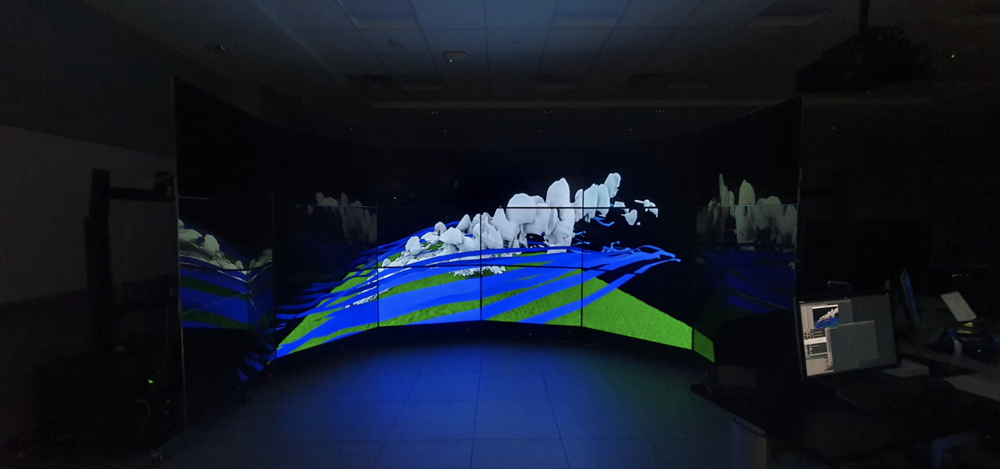

# Immersive OSPRay Studio
We provide several extensions to [OSPRay Studio v1.0.0](https://github.com/RenderKit/ospray-studio/releases/tag/v1.0.0) to enable immersive virtual reality and storytelling experiences.

1. Display a single, coherent virtual environment on tiled display walls
   * [a branch in OSPRay Studio](https://github.com/JungWhoNam/ospray_studio/tree/jungwho.nam-feature-multidisplays): an extension to support the display feature
   * [Configuration Generator](https://github.com/JungWhoNam/ConfigurationGenerator): Unity project for arranging display objects in a spatial layout and save the configuration in a JSON file
2. Use gesture-based interaction techniques
   * [a plugin for OSPRay Studio](https://github.com/JungWhoNam/ospray_studio/tree/jungwho.nam-feature-plugin-gesture): a plugin to support a flying gesture to move around in a 3D environement
   * [Gesture Tracking Server](https://github.com/JungWhoNam/GestureTrackingServer): C++ TCP server that sends body tracking data from Kinect SDK to connected clients
3. Create annotated, animated stories
   * [a plugin for OSPRay Sutdio](https://github.com/JungWhoNam/ospray_studio/tree/jungwho.nam-feature-plugin-storyboard): a plugin to support the story creation
   * [Storyboard](https://github.com/JungWhoNam/Storyboard): Unity client for constructing a story
   * [V-Mail Server](https://github.com/JungWhoNam/VisualizationMailServer): a server for managing created stories
4. *(UPCOMING)* Move around a 3D environment using spoken words 

> [!NOTE]
> See [this branch in OSPRay Studio](https://github.com/JungWhoNam/ospray_studio/tree/jungwho.nam-feature-immersive-latest) that merges all the extensions made to OSPRay Studio.

## 1. Display a single, coherent virtual environment on tiled display walls

We extended the application to simultaneously run multiple windows and move/scale these windows to create a large window. In the image, you see OSPRay Studio running on [TACC's Rattler system](https://www.tacc.utexas.edu/systems/rattler/), a tiled-display system driven by a cluster of 19 Linux PCs. Each node runs an MPI-process that shows a window on display, and all the displays form a hemisphere providing a surrounding view.

> [!NOTE]  
See [this branch](https://github.com/JungWhoNam/ospray_studio/tree/jungwho.nam-feature-multidisplays) for details and installation steps.

    <table>
	    <tr>
    	    <td style="padding:4px">
        	    
      	    </td>
            <td style="padding:4px">
            	
            </td>
        </tr>
    </table>

At the start, the application reads [a JSON configuration file](https://github.com/JungWhoNam/ospray_studio/tree/jungwho.nam-feature-multidisplays?tab=readme-ov-file#support-other-display-settings) to set its cameras and arrange windows. We provide [this Unity project](https://github.com/JungWhoNam/ConfigurationGenerator) to assist users in creating this JSON file.

## 2. Use gesture-based interaction techniques

We created [a plugin](https://github.com/jungwhonam/ospray_studio/tree/jungwho.nam-feature-plugin-gesture/plugins/gesture_plugin) and [a server application](https://github.com/jungwhonam/GestureTrackingServer) to support a flying gesture to move in a 3D virtual environment. The server application gets body tracking data from Microsoft Kinect SDK and send these to connected clients. The plugin detects a flying gesture from the recieved data and moves the camera accordingly. 

In the video, a user moves around a 3D virtual environment by lifting both hands - pretending to be a bird - and leaning the body to fly in that direction. When multiple users are presented in the area, the user closest to the sensor is considered the primary user.

> [!NOTE]  
See [the plugin](https://github.com/jungwhonam/ospray_studio/tree/jungwho.nam-feature-plugin-gesture/plugins/gesture_plugin) for details and installation steps.

## 3. Create annotated, animated stories

We created a plugin to incorporate [Visualization Mail (V-Mail)](https://github.com/JungWhoNam/VisualizationMail) capabilities, which enables users to create annotated, animated stories directly from OSPRay Studio.

In the above image, you see three applications:
1. Top-left: OSPRay Studio with [the plugin](https://github.com/JungWhoNam/ospray_studio/tree/jungwho.nam-feature-plugin-storyboard/plugins/storyboard_plugin)
2. Bottom-left: [the server](https://github.com/JungWhoNam/VisualizationMailServer) for managing created stories
3. Right: [Unity client](https://github.com/JungWhoNam/Storyboard) for constructing a story

> [!NOTE]  
See [the plugin](https://github.com/JungWhoNam/ospray_studio/tree/jungwho.nam-feature-plugin-storyboard/plugins/storyboard_plugin) for details and installation steps.

## *(UPCOMING)* 4. Move around a 3D environment using spoken words
The goal is to create a plugin with voice-control capabilities so users can move around a 3D environment using spoken words.